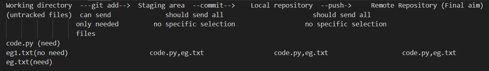

# California House Pricing Prediction

### Software and tools required

1. [Github Account](https://github.com)
2. [Vs Code IDE](https://code.visualstudio.com/)
3. [Heroku Account](https://heroku.com)
4. [GitCLI](https://git-scm.com/downloads)
5. [Postman](https://www.postman.com/downloads/)
6. [JSON Validator](https://jsonlint.com/)

### Clone the repository created to the local and Navigate to the local folder address in the local
git clone url_of_the_clone_local_from_website

### Copy the model ipynb code file and pickle file to this folder in local.

### Create a new environment for the project. Go to the location of the project folder.
...
conda create -p venv python==3.7 -y
conda activate venv/
...

### In the folder, create a requirements file with libraries you needed to run the code. and then, In the environment
pip install -r requirements.txt

### Setting up configurations. Adding github logins to git CLI
git config --global user.name "name"
git config --global user.name "PujaAnkithaIvaturi"
git config --global user.email "email"

### Adding a file
git add requirements.txt
git status

### Knowledge on git status

### To add file/s from working directory to stage area, use git add command
#### Specific
git add filename
#### Send all
git add .

### Commiting files. Sending files from stageing area to local repository.
#### !!!! Important!!!! Always use -m message option in commit command to note what are the changes you are commiting or the files you are adding.
git commit -m "This commit includes requirement.txt and readme file."

### Final stage: Pushing files from local to remote repository
git push <remote> <branch>
git push origin main

### Create app.py and necessary templates
Write the code with routes, templates, and connect the pickled models, render preprocessing over the input given and return the output

### Check the connection to the app using the command
python app.py 
and navigate through the localhost link http://127.0.0.1:5000
Try to go for http://127.0.0.1:5000/predict_api
If not, you haven't created a postman API that deals with the requests

### Using Postman
Create a request with the post link used in the app.py file
http://127.0.0.1:5000/predict_api
Then Body -> raw with JSON 
The body should be the key value JSON pairs. My json dict be {
    "data":{
    "MedInc": 7.0,
    "HouseAge": 35.0,
    "AveRooms": 5.5,
    "AveBedrms": 1.2,
    "Population": 800.0,
    "AveOccup": 2.8,
    "Latitude": 37.90,
    "Longitude": -122.20
    }
}

Check whether it is a valid json pairs or not, using json validator. JSON_validator(https://jsonlint.com/) Paste the data into that, and see if it says valid or not. if yes, done.
Go back to postman, Hit on send. We should get the response as output.

